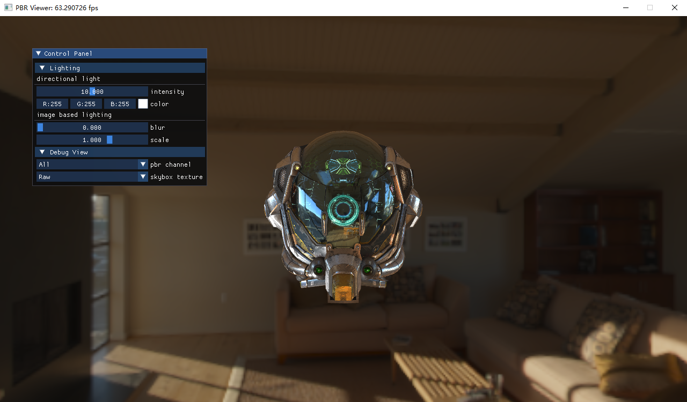
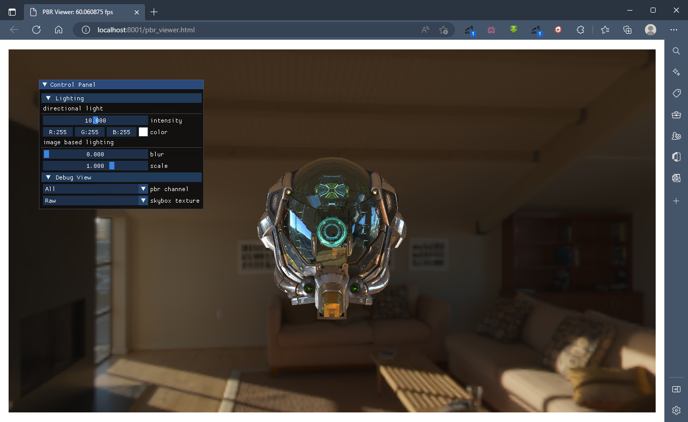

## CG Projects

### Introduction
This is the assignments for the Computer Graphics course, through which you'll learn how to:
+ construct the simplest framework for a Computer Graphics program;
+ display geometry and pixel data on the screen;
+ use modern OpenGL API (3.3+);
+ use GLSL, a Shading Language compatible with OpenGL;

This will help you understanding:
+ the basic concepts in Computer Graphics:
    + geometry
    + lighting
    + texture
    + graphics pipleine etc;
+ how GPU works to display a frame on the screen;

Basically, I follow the [Learning OpenGL](https://learnopengl-cn.github.io/) tutorials and refactor the old version assignments in an object oriented way. The students should have some knowledge of modern C++. Don't be panic if you haven't learnt C++ yet. You'll write no more than 20 lines of code for most of the assignments.

You can find more materials on [Bilibili](https://space.bilibili.com/52683403/channel/collectiondetail?sid=749547&ctype=0)

You can also find the reference demos on [Github](https://github.com/syby119/CG-projects-reference)

### Get the repository
```shell
git clone --depth=1 https://github.com/syby119/CG-projects.git
cd CG-projects
git submodule init
git submodule update
```

### How to run

#### Preliminaries
+ CMake >= 3.20
+ C++ Compiler supports at least C++14

#### Build and Compile
```shell
cmake -Bbuild .
cmake --build build --config Release --parallel 8
```

#### Run
```shell
cd build/bin/Release
./pbr_viewer.exe
```

<div style="text-align:center">
    
</div>

### How to run in Browser

#### Preliminaries
+ CMake >= 3.20
+ Python >= 3.6
+ [Emscripten](https://emscripten.org/)
+ [emcmake compatible CMake generator](https://badlydrawnrod.github.io/posts/2020/05/19/emcmake-with-emscripten/)

#### Switch Branch
```shell
git remote set-branches origin web
git fetch --depth=1 origin web
git checkout web
```

#### Build and Compile
```shell
python build_webassembly.py -Dbuild_web
```

#### Run
```shell
cd build_web/bin/browser
python run_webassembly.py pbr_viewer.html
```

<div style="text-align:center">
    
</div>

### Screenshots

| **get_start: triangle**                              | **pbr_viewer: PBR/IBL**                               |
| :--------------------------------------------------: | :---------------------------------------------------: |
|  |  |
| **project1: geometry**                               | **bonus1: transparency**                              |
|    |      |
| **project2: transformation**                         | **bonus2: frustum culling**                           |
|   |      |
| **project3: scene roaming**                          | **bonus3: post processing**                           |
|   |      |
| **project4: instanced rendering**                    | **bonus4: shadow mapping**                            |
|   |      |
| **project5: shading tutorial**                       | **bonus5: raytracing**                                |
|   |      |
| **project6: texture mapping**                        |                                                       |
|   |                                                       |

### Platform

|                | **Windows 10** | **WSL 2** | **Ubuntu 20.04** | **MacOS** | **Chrome 107 Windows10** |
| :------------: | :------------: | :-------: | :--------------: | :-------: | :----------------------: |
| **get_start**  | &#9745;        | &#9745;   | &#9745;          | &#9745;   | &#9745;                  |
| **project1**   | &#9745;        | &#9745;   | &#9745;          | &#9745;   | &#9745;                  |
| **project2**   | &#9745;        | &#9745;   | &#9745;          | &#9745;   | &#9745;                  |
| **project3**   | &#9745;        | &#9745;   | &#9745;          | &#9745;   | &#9745;                  |
| **project4**   | &#9745;        | &#9745;   | &#9745;          | &#9745;   | &#9745;                  |
| **project5**   | &#9745;        | &#9745;   | &#9745;          | &#9745;   | &#9745;                  |
| **project6**   | &#9745;        | &#9745;   | &#9745;          | &#9745;   | &#9745;                  |
| **bonus1**     | &#9745;        | &#9745;   | &#9745;          | &#9745;   | &#9745;                  |
| **bonus2**     | &#9745;        | &#9745;   | &#9745;          | &#9745;   | &#9745;                  |
| **bonus3**     | &#9745;        | &#9745;   | &#9745;          | &#9745;   | &#9745;                  |
| **bonus4**     | &#9745;        | &#9745;   | &#9745;          | &#9745;   | &#9745;                  |
| **bonus5**     | &#9745;        | &#9745;   | &#9745;          | &#9745;   | &#9745;                  |
| **pbr_viewer** | &#9745;        | &#9745;   | &#9745;          | &#9745;   | &#9745;                  |
