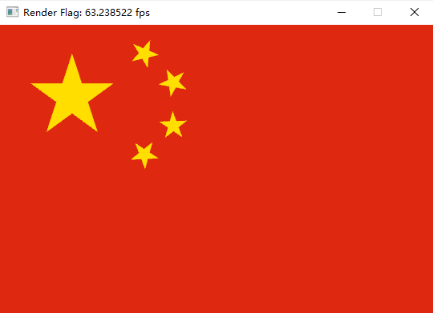
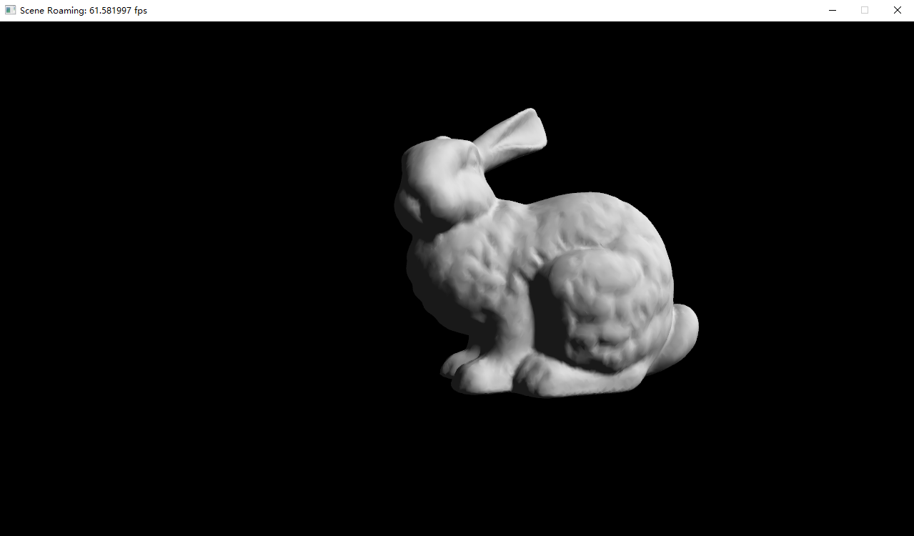
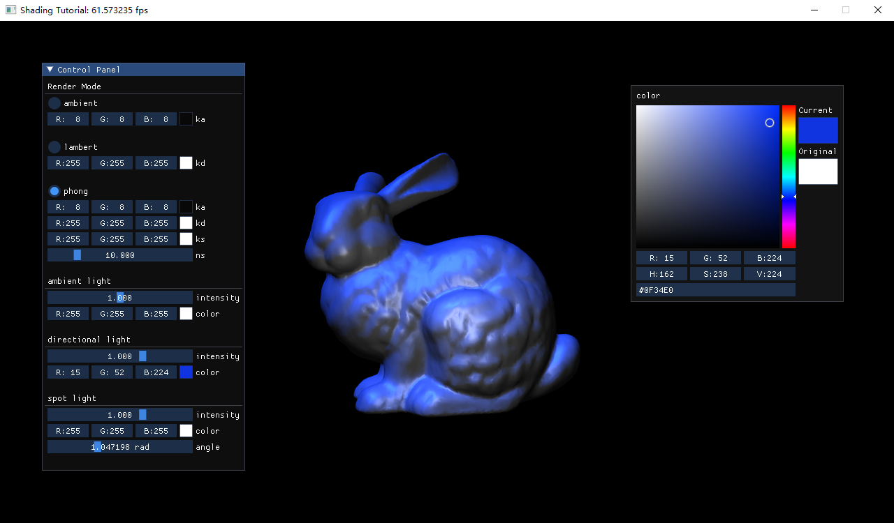
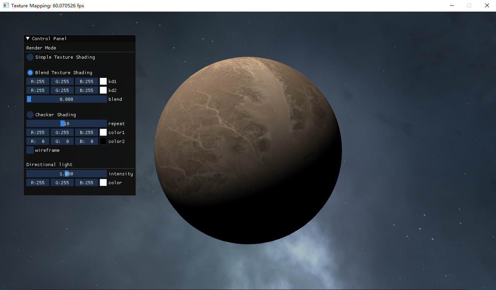
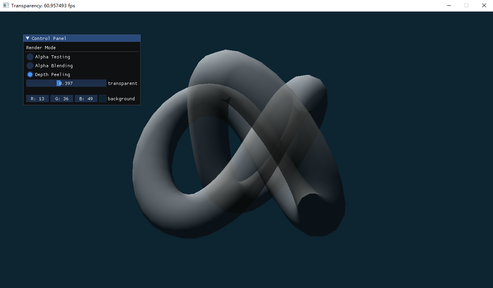
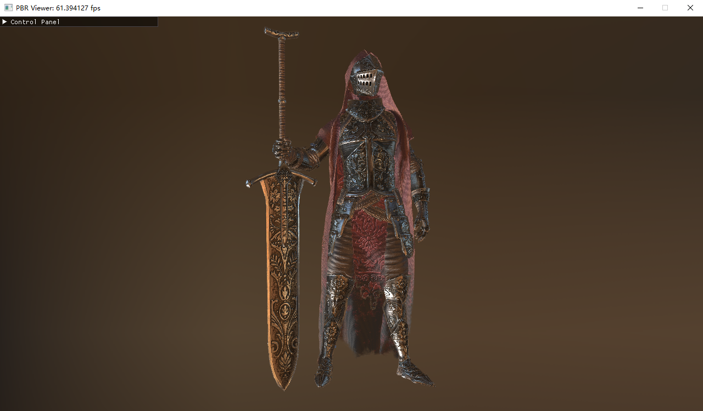

## CG Projects

#### Introduction
This is the assignments for the Computer Graphics course, through which you'll learn how to:
+ construct the simplest framework for a Computer Graphics program;
+ display geometry and pixel data on the screen;
+ use modern OpenGL API (3.3+);
+ use GLSL, a Shading Language compatible with OpenGL;

This will help you understanding:
+ the basic concepts in Computer Graphics: 
    + geometry
    + lighting
    + texture
    + graphics pipleine etc;
+ how GPU works to display a frame on the screen;

Basically, I follow the [Learning OpenGL](https://learnopengl-cn.github.io/) tutorials and refactor the old version assignments in an object oriented way. The students should have some knowledge of modern C++. Don't be panic if you haven't learnt C++ yet. You'll write no more than 20 lines of code for most of the assignments.

You can find more materials in [Bilibili](https://space.bilibili.com/52683403/channel/seriesdetail?sid=2403889)

#### How to run

##### Preliminaries
+ install cmake >= 3.15
+ C++ Compiler supports at least C++14

##### Build and Compile
```shell
cmake -Bbuild .
cd build
cmake --build . --parallel 8
```

##### Run
```shell
cd bin/Debug
./project1.exe
```

#### Windows Executables
##### Render a Triangle
```shell
cd ./demo/winexe
./get_start.exe
```

<div style="text-align:center">
    
</div>

##### Render the Chinese National Flag
```shell
cd ./demo/winexe
./project1.exe
```
<div style="text-align:center">
    
</div>

##### Transformation Matrices
```shell
cd ./demo/winexe
./project2.exe
```
<div style="text-align:center">
    
</div>

##### Scene Roaming
```shell
cd ./demo/winexe
./project3.exe
```

<div style="text-align:center">
    
</div>

##### Instanced Rendering
```shell
cd ./demo/winexe
./project4.exe
```

<div style="text-align:center">
    
</div>

##### Shading Tutorial
```shell
cd ./demo/winexe
./project5.exe
```

<div style="text-align:center">
    
</div>

##### Texture Mapping
```shell
cd ./demo/winexe
./project6.exe
```

<div style="text-align:center">
    
</div>

##### Transparency Rendering
```shell
cd ./demo/winexe
./bonus1.exe
```

<div style="text-align:center">
    
</div>

##### Frustum Culling
```shell
cd ./demo/winexe
./bonus2.exe
```

<div style="text-align:center">
    
</div>

##### PBR Viewer
```shell
cd ./demo/winexe
./pbr_viewer.exe
```

<div style="text-align:center">
    
</div>
