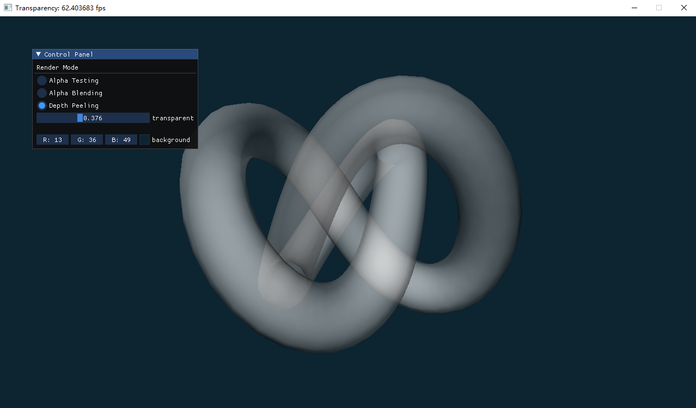

## Bonus 1: OpenGL透明物体绘制
---

- 专业：
- 姓名：
- 学号：
- 日期：

#### 一、实验目的和要求
使用透明度测试，透明度混合与顺序无关透明度绘制算法绘制如下环状物体，并与背景色叠加。
<div style="text-align:center;">
  
</div>

#### 二、实验内容和原理

这是如何在Markdown中插入行内公式的示例$E = mc^2$，而下面则是插入一般公式的实例
$$
\left[\begin{matrix} a & b \\ c & d \end{matrix}\right]^{-1} =
\frac{1}{ad - bc} \left[\begin{matrix}d & - b \\- c & a\end{matrix}\right]
$$

#### 三、运行环境

#### 四、操作方法和实验步骤
```C++
// 这是一段如何在Markdown中插入C++的实例
int main() {
   return 0;
}
```

#### 五、实验结果与分析

#### 六、讨论、心得

#### 七、参考链接
+ [混合](https://learnopengl-cn.github.io/04%20Advanced%20OpenGL/03%20Blending/)
+ [帧缓冲](https://learnopengl-cn.github.io/01%20Getting%20started/08%20Coordinate%20Systems/)
+ [深度测试](https://learnopengl-cn.github.io/01%20Getting%20started/08%20Coordinate%20Systems/)
+ [Interactive Order-Independent Transparency](https://link.zhihu.com/?target=https:/www.gamedevs.org/uploads/interactive-order-independent-transparency.pdf)
+ [Order Independent Transparency with Dual Depth Peeling](https://link.zhihu.com/?target=https://citeseerx.ist.psu.edu/viewdoc/download?doi=10.1.1.193.3485&rep=rep1&type=pdf)
+ [图形学基础 - 着色 - 透明度混合-OIT](https://zhuanlan.zhihu.com/p/368065919)
+ [Why Alpha Premultiplied Colour Blending Rocks](https://amindforeverprogramming.blogspot.com/2013/07/why-alpha-premultiplied-colour-blending.html)
+ [关于理解 Premultiplied Alpha 的一些 Tips](https://zhuanlan.zhihu.com/p/344751308)
+ [关于从前向后透明渲染方法的最终效果是否正确](https://www.zhihu.com/question/398853952)
