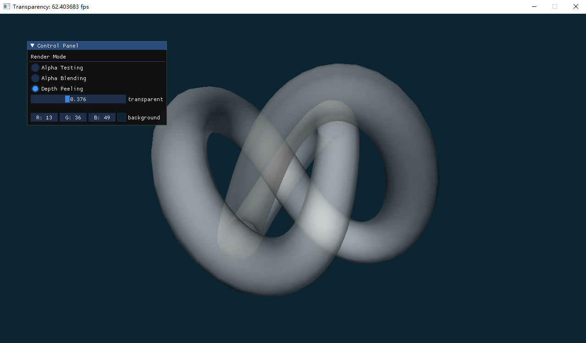

## Bonus 1: OpenGL透明物体绘制
---

- 专业：
- 姓名：
- 学号：
- 日期：

#### 一、实验目的和要求
使用透明度测试，透明度混合与顺序无关透明度绘制算法绘制如下环状物体，并与背景色叠加。
<div style="text-align:center;">
  
</div>

#### 二、实验内容和原理

#### 三、主要仪器设备

#### 四、操作方法和实验步骤

#### 五、实验结果与分析

#### 六、讨论、心得

#### 七、附录

##### 7.1 透明度叠加原理

假设由远及近依次有 $n$ 个半透明薄片 $(C_1,A_1)$、$(C_2,A_2)$、…、$(C_n,A_n)$。

##### 7.1.1 Over 操作

Over操作即由远及近地叠加颜色。考虑两个物体的情况：设底层透明物体颜色为 $(C_{dst}, A_{dst})$，顶层透明物体颜色为 $(C_{src}, A_{src})$，则两个半透明物体的最终颜色为：

$$
C = A_{src}C_{src} + (1-A_{src})C_{dst}
$$

由Over操作我们可以证明，上述 $n$ 个物体的最终颜色为：

$$
C = \sum_{i=1}^{n}\frac{1}{1-A_i}A_iC_i\prod_{j=i}^{n}(1-A_j)
$$

##### 7.1.2 Under 操作

Under操作即由近及远地叠加颜色。考虑两个物体的情况：设底层透明物体颜色为 $(C_{src}, A_{src})$，顶层透明物体颜色为 $(C_{dst}, A_{dst})$，则两个半透明物体的最终颜色与透明度为：

$$
C = A_{dst}(A_{src}C_{src}) + C_{dst}
$$

$$
A = (1-A_{src})A_{dst}
$$

其中，需要引入额外的约束：$C_{dst}$ 的初值为 $(0,0,0)$，$A_{dst}$ 的初值为 $1$。由Under操作我们可以证明，上述 $n$ 个物体的最终颜色为：

$$
C = \sum_{i=1}^{n}\frac{1}{1-A_i}A_iC_i\prod_{j=i}^{n}(1-A_j)
$$

证明如下：

当 $n=1$ 时，显然成立，即：

$$
C^1=A_1C_1
$$

$$
A^1=1-A_1
$$

设当 $n=k$ 时，原式成立，即：

$$
C^k=\sum_{i=1}^{k}\frac{1}{1-A_i}A_iC_i\prod_{j=i}^{k}(1-A_j)
$$

$$
A^k=\prod_{j=1}^{k}(1-A_j)
$$

则当 $n=k+1$ 时：

$$
\begin{aligned}
C^{k+1}
&=\prod_{i=2}^{k+1}(1-A_i)A_1C_1
+\left(\sum_{i=2}^{k+1}\frac{1}{1-A_i}A_iC_i\prod_{j=i}^{k+1}(1-A_j)\right)\\
&=\frac{1}{1-A_1}A_1C_1\prod_{i=1}^{k+1}(1-A_i)
+\left(\sum_{i=2}^{k+1}\frac{1}{1-A_i}A_iC_i\prod_{j=i}^{k+1}(1-A_j)\right)\\
&=\sum_{i=1}^{k+1}\frac{1}{1-A_i}A_iC_i\prod_{j=i}^{k+1}(1-A_j)
\end{aligned}
$$

$$
A^{k+1}=(1-A_1)\prod_{i=2}^{k+1}(1-A_i)=\prod_{i=1}^{k+1}(1-A_i)
$$

由数学归纳法，原式得证。

##### 7.1.3 OpenGL 中的 Over 操作

在着色器中先计算预乘颜色 `Csrc * Asrc`，再配置混合状态：

```C++
glEnable(GL_BLEND);
glBlendEquation(GL_FUNC_ADD);
glBlendFuncSeparate(GL_DST_ALPHA, GL_ONE, GL_ZERO, GL_ONE_MINUS_SRC_ALPHA);
```

此外，对第一层被绘制的透明层，需要在颜色缓冲中写入 $(A_nC_n, 1-A_n)$。最终与背景色叠加时采用如下公式：

$$
C_{dst}=A_{dst}C_{bg}+C_{dst}
$$

##### 7.1.4 说明

透明度叠加原理及 Under 操作公式参考链接 [5]；部分其他资料给出的 Under 公式不同，可作为对比验证。

#### 八、参考链接
+ [混合](https://learnopengl-cn.github.io/04%20Advanced%20OpenGL/03%20Blending/)
+ [帧缓冲](https://learnopengl-cn.github.io/01%20Getting%20started/08%20Coordinate%20Systems/)
+ [深度测试](https://learnopengl-cn.github.io/01%20Getting%20started/08%20Coordinate%20Systems/)
+ [Interactive Order-Independent Transparency](https://link.zhihu.com/?target=https:/www.gamedevs.org/uploads/interactive-order-independent-transparency.pdf)
+ [Order Independent Transparency with Dual Depth Peeling](https://link.zhihu.com/?target=https://citeseerx.ist.psu.edu/viewdoc/download?doi=10.1.1.193.3485&rep=rep1&type=pdf)
+ [图形学基础 - 着色 - 透明度混合-OIT](https://zhuanlan.zhihu.com/p/368065919)
+ [Why Alpha Premultiplied Colour Blending Rocks](https://amindforeverprogramming.blogspot.com/2013/07/why-alpha-premultiplied-colour-blending.html)
+ [关于理解 Premultiplied Alpha 的一些 Tips](https://zhuanlan.zhihu.com/p/344751308)
+ [关于从前向后透明渲染方法的最终效果是否正确](https://www.zhihu.com/question/398853952)
