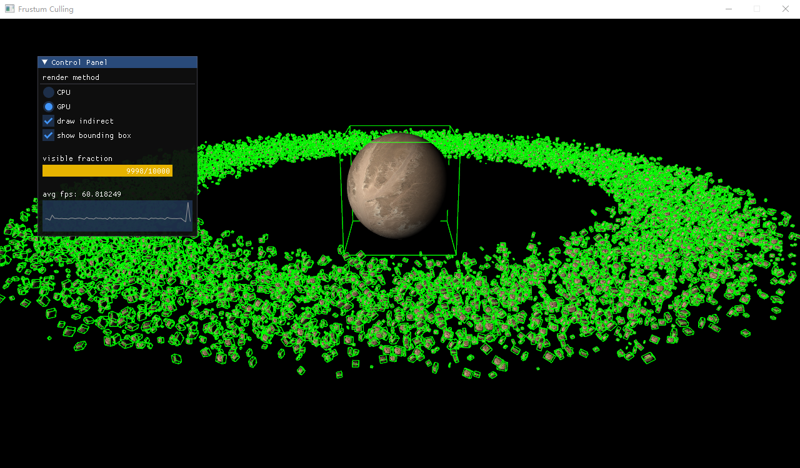

## Bonus 2: OpenGL视锥剔除
---

- 专业：
- 姓名：
- 学号：
- 日期：

#### 一、实验目的和要求
使用CPU和GPU算法进行物体包围盒的视锥体剔除，从而提升程序的绘制效率。
<div style="text-align:center;">
  
</div>

#### 二、实验内容和原理

这是如何在Markdown中插入行内公式的示例$E = mc^2$，而下面则是插入一般公式的实例
$$
\left[\begin{matrix} a & b \\ c & d \end{matrix}\right]^{-1} =
\frac{1}{ad - bc} \left[\begin{matrix}d & - b \\- c & a\end{matrix}\right]
$$

#### 三、运行环境

#### 四、操作方法和实验步骤
```C++
// 这是一段如何在Markdown中插入C++的实例
int main() {
   return 0;
}
```

#### 五、实验结果与分析

#### 六、讨论、心得

#### 七、参考链接
+ [Frustum Culling](https://learnopengl.com/Guest-Articles/2021/Scene/Frustum-Culling)
+ [OpenGL Transform Feedback](https://open.gl/feedback)