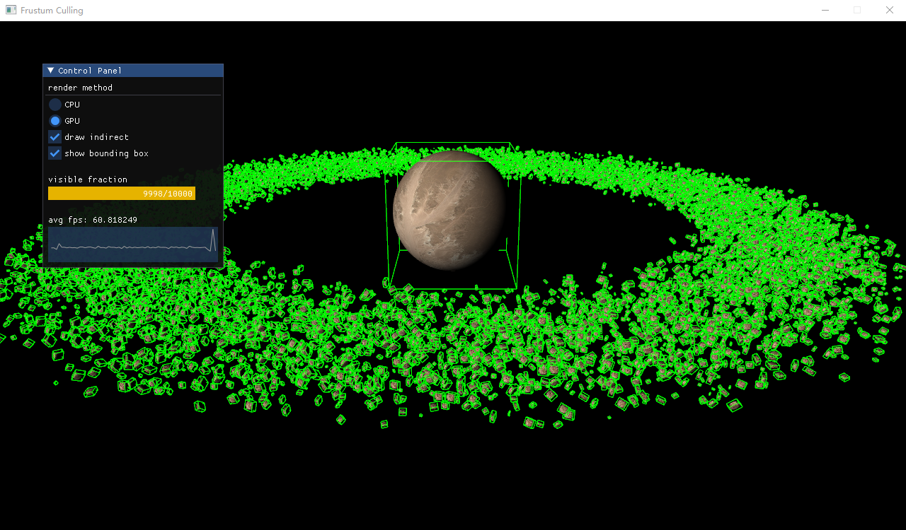

## Bonus 2: OpenGL视锥剔除
---

- 专业：
- 姓名：
- 学号：
- 日期：

#### 一、实验目的和要求
使用CPU和GPU算法进行物体包围盒的视锥体剔除，从而提升程序的绘制效率。

  

#### 二、实验内容和原理

#### 三、主要仪器设备

#### 四、操作方法和实验步骤

#### 五、实验结果与分析

#### 六、讨论、心得

#### 七、参考链接
+ [Frustum Culling](https://learnopengl.com/Guest-Articles/2021/Scene/Frustum-Culling)
+ [OpenGL Transform Feedback](https://open.gl/feedback)
