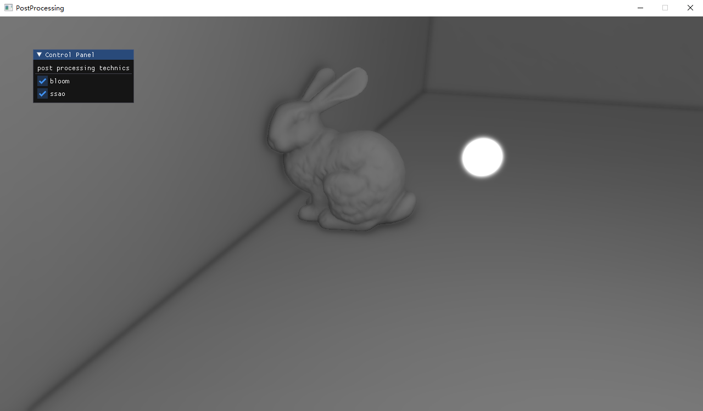

## Bonus 3: 后处理
---

- 专业：
- 姓名：
- 学号：
- 日期：

#### 一、实验目的和要求
完成指定场景的后处理效果绘制：
+	实现泛光效果
+	了解延迟着色法，并实现SSAO

实现：
+ extract_bright_color.frag：提取帧中超过一定亮度的像素
+ gaussian_blur.frag : 高斯模糊
+ ssao.frag：计算occlusion
+ ssao_lighting.frag: 考虑occlusion对着色的影响，实现SSAO

<div style="text-align:center;">
  
</div>

#### 二、实验内容和原理

这是如何在Markdown中插入行内公式的示例$E = mc^2$，而下面则是插入一般公式的实例
$$
\left[\begin{matrix} a & b \\ c & d \end{matrix}\right]^{-1} =
\frac{1}{ad - bc} \left[\begin{matrix}d & - b \\- c & a\end{matrix}\right]
$$

#### 三、运行环境

#### 四、操作方法和实验步骤
```C++
// 这是一段如何在Markdown中插入C++的实例
int main() {
   return 0;
}
```

#### 五、实验结果与分析

#### 六、讨论、心得

#### 七、参考链接
+ [泛光](https://learnopengl-cn.github.io/05%20Advanced%20Lighting/07%20Bloom/)
+ [SSAO](https://learnopengl-cn.github.io/05%20Advanced%20Lighting/09%20SSAO/)
+ [延迟着色法](https://learnopengl-cn.github.io/05%20Advanced%20Lighting/08%20Deferred%20Shading/)
+ [帧缓冲](https://learnopengl-cn.github.io/04%20Advanced%20OpenGL/05%20Framebuffers/)