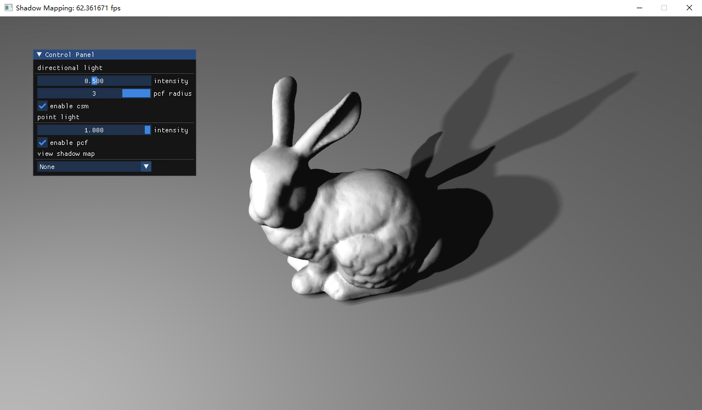

## Bonus 4: OpenGL阴影映射
---

- 专业：
- 姓名：
- 学号：
- 日期：

#### 一、实验目的和要求
完成指定场景的多重软阴影绘制：
+	使场景中的物体受点照射光源并产生阴影
+	使场景中的物体受平行光源照射并产生阴影
+	使用CSM算法优化平行光投射的阴影，并比较与2中的不同
+	使用PCF算法使上述阴影边缘柔化

<div style="text-align:center;">
  
</div>

#### 二、实验内容和原理

这是如何在Markdown中插入行内公式的示例$E = mc^2$，而下面则是插入一般公式的实例
$$
\left[\begin{matrix} a & b \\ c & d \end{matrix}\right]^{-1} =
\frac{1}{ad - bc} \left[\begin{matrix}d & - b \\- c & a\end{matrix}\right]
$$

#### 三、运行环境

#### 四、操作方法和实验步骤
```C++
// 这是一段如何在Markdown中插入C++的实例
int main() {
   return 0;
}
```

#### 五、实验结果与分析

#### 六、思考题
+ 阴影映射中的会有那些失真的现象，如何克服这些问题？
+ 如何通过场景中物体的包围盒进一步限制平行光projection matrix的远近平面？以下两者分别产生了什么影响？
  + Shadow Caster
  + Shadow Receiver
+ 为什么LearnOpenGL中的点光源阴影要使用距离而不是深度？
+ Cascade Shadow Mapping解决了什么问题
+ LearnOpenGL CSM教程中，使用了zMult来缩放投影矩阵的远近平面，这么做是否正确？

#### 七、参考链接
+ [阴影映射](https://learnopengl-cn.github.io/05%20Advanced%20Lighting/03%20Shadows/01%20Shadow%20Mapping/)
+ [点阴影](https://learnopengl-cn.github.io/05%20Advanced%20Lighting/03%20Shadows/02%20Point%20Shadows/)
+ [LearnOpenGL-CSM](https://learnopengl.com/Guest-Articles/2021/CSM)
+ [Tutorial49 - Cascade Shadow Mapping](https://ogldev.org/www/tutorial49/tutorial49.html)
+ [Chapter 10. Parallel-Split Shadow Maps on Programmable GPUs](https://developer.nvidia.com/gpugems/gpugems3/part-ii-light-and-shadows/chapter-10-parallel-split-shadow-maps-programmable-gpus)