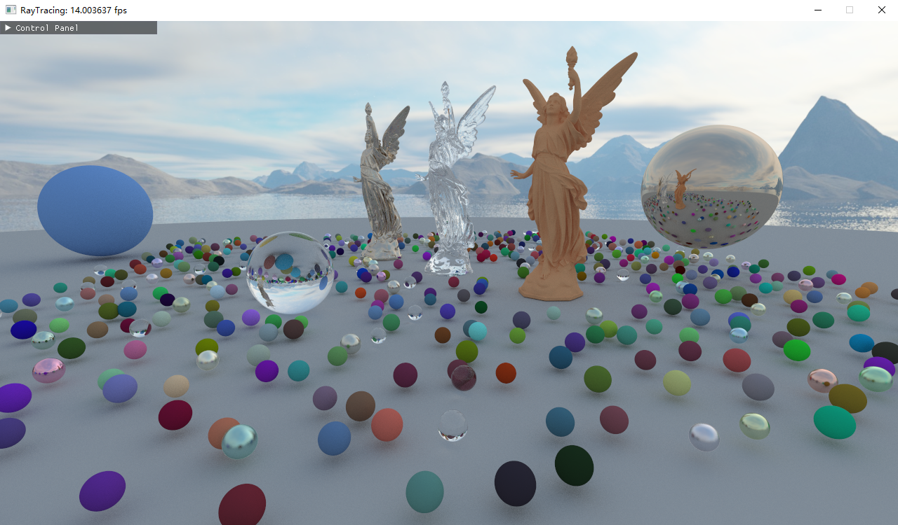
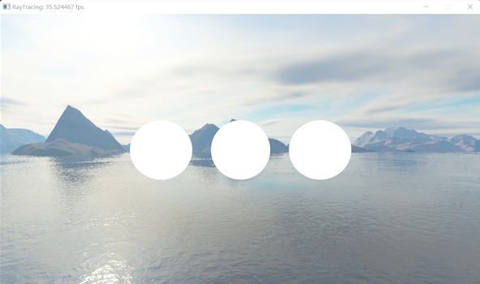
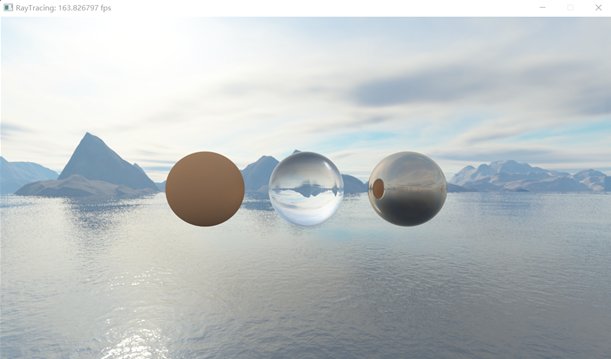
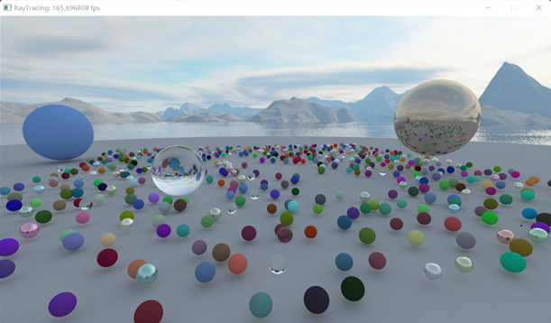
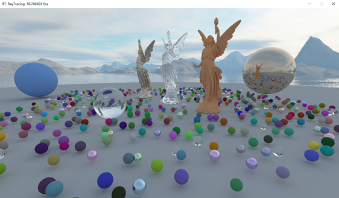

## Bonus 5: OpenGL光线追踪
---

- 专业：
- 姓名：
- 学号：
- 日期：

#### 一、实验目的和要求
完成指定场景的光线追踪：
+ 计算光线的初始状态
+ 实现Lambertian、Metal、Dielectric材质
+ 光线和球的求交算法
+ 光线和三角形的求交算法
+ 实现BVH加速结构

<div style="text-align:center;">
  
</div>

#### 二、实验内容和原理

这是如何在Markdown中插入行内公式的示例$E = mc^2$，而下面则是插入一般公式的实例
$$
\left[\begin{matrix} a & b \\ c & d \end{matrix}\right]^{-1} =
\frac{1}{ad - bc} \left[\begin{matrix}d & - b \\- c & a\end{matrix}\right]
$$

#### 三、运行环境

#### 四、操作方法和实验步骤
```C++
// 这是一段如何在Markdown中插入C++的实例
int main() {
   return 0;
}
```

#### 五、实验结果与分析

#### 六、讨论、心得

#### 七、附录
函数功能查看raytracing.frag注释。
以下参考内容帮助大家逐步实现最终效果。

+ **场景1：实现光线与球求交**
  修改raytracing.frag如下函数：
  + vec4 trace(inout Ray ray);
  + vec3 getHitPoint(inout Ray ray, float t);
  + bool intersectSphere(inout Ray ray, inout Sphere sphere, inout Interaction isect);

<div style="text-align:center;">
  
</div>

+ **场景1：实现不同材质**
  修改raytracing.frag如下函数：
  +	vec4 trace(inout Ray ray);
  +	bool lambertianScatterFunction(inout Ray ray, inout Interaction isect);
  +	bool metalScatterFunction(inout Ray ray, inout Interaction isect);
  +	void dielectricScatterFunction(inout Ray ray, inout Interaction isect);

  随机采样光线反射方向时，采用如下任一函数并比较结果：
  +	vec3 uniformSampleHemiSphere(vec2 u);
  +	vec3 cosineWeightedSampleHeimiSphere(vec2 u);

<div style="text-align:center;">
  
</div>

+ **场景2：实现BVH构建、序列化、遍历**
  修改primitive.cpp如下函数：
  + BVHBuildNode* recursiveBuild(const std::vector<Primitive>& primitives,
        std::vector<PrimitiveInfo>& primInfo, std::vector<int>& record,
        int start, int end, int* totalNodes);

  修改raytracing.frag如下函数：
  + vec4 trace(inout Ray ray);
  + bool intersect(inout Ray ray, inout Interaction isect);
  + bool intersectAABB(inout Ray ray, inout AABB box, inout vec3 invDir);
  + bool intersectPrimitive(inout Ray ray, inout Primitive primitive, inout Interaction isect);

<div style="text-align:center;">
  
</div>


+ **场景3：实现光线与三角形的求交算法**
  修改raytracing.frag如下函数：
  +	vec4 trace(inout Ray ray);
  +	bool intersect(inout Ray ray, inout Interaction isect);
  +	bool intersectAABB(inout Ray ray, inout AABB box, inout vec3 invDir);
  +	bool intersectPrimitive(inout Ray ray, inout Primitive primitive, inout Interaction isect);
  +	bool intersectTriangle(inout Ray ray, inout Triangle mesh, inout Interaction isect);

<div style="text-align:center;">
  
</div>


#### 八、参考链接
+ [Projective Camera Models](https://pbr-book.org/3ed-2018/Camera_Models/Projective_Camera_Models)
+ [RayTracingInOneWeekend](https://raytracing.github.io/books/RayTracingInOneWeekend.html)
+ [Bounding Volume Hierarchies](https://www.pbr-book.org/3ed-2018/Primitives_and_Intersection_Acceleration/Bounding_Volume_Hierarchies)
+ [Lecture 13 Ray Tracing 1](https://www.bilibili.com/video/BV1X7411F744/?p=13)
+ [Lecture 14 Ray Tracing 2](https://www.bilibili.com/video/BV1X7411F744/?p=14)
+ [Lecture 15 Ray Tracing 3](https://www.bilibili.com/video/BV1X7411F744/?p=15)
+ [Lecture 16 Ray Tracing 4](https://www.bilibili.com/video/BV1X7411F744/?p=16)