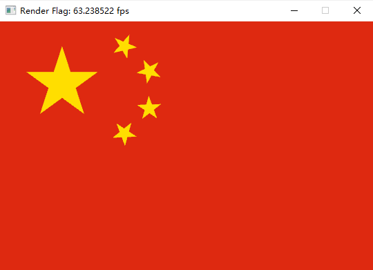

## Project 1: OpenGL绘制五星红旗
---

- 专业：
- 姓名：
- 学号：
- 日期：

#### 一、实验目的和要求
学会配置OpenGL开发环境并使用图形API绘制五星红旗。
<div style="text-align:center;">
  
</div>

#### 二、实验内容和原理

这是如何在Markdown中插入行内公式的示例$E = mc^2$，而下面则是插入一般公式的实例
$$
\left[\begin{matrix} a & b \\ c & d \end{matrix}\right]^{-1} =
\frac{1}{ad - bc} \left[\begin{matrix}d & - b \\- c & a\end{matrix}\right]
$$

#### 三、运行环境

#### 四、操作方法和实验步骤
```C++
// 这是一段如何在Markdown中插入C++的实例
int main() {
   return 0;
}
```

#### 五、实验结果与分析

#### 六、思考题
+ 什么是OpenGL的裁剪坐标系(Clip Space)？
+ 什么是OpenGL的标准化设备坐标(Normalized Device Coordinates)？
+ 什么是OpenGL的窗口坐标系(Window Space/Screen Space)？
+ OpenGL是如何把Clip Space坐标系中的坐标变换到NDC坐标系的？
+ OpenGL是如何把NDC坐标系中的坐标变换到窗口坐标系的？
    + 与哪些参数有关
    + 由哪些函数控制
    + 请给出上述变换的矩阵表达形式
+ 请给出从窗口坐标系到NDC坐标系的变换矩阵。

#### 七、参考链接
+ [OpenGL介绍](https://learnopengl-cn.github.io/01%20Getting%20started/01%20OpenGL/)
+ [GLFW与glad配置](https://learnopengl-cn.github.io/01%20Getting%20started/02%20Creating%20a%20window/)
+ [窗口初始化](https://learnopengl-cn.github.io/01%20Getting%20started/03%20Hello%20Window/)
+ [绘制三角形](https://learnopengl-cn.github.io/01%20Getting%20started/04%20Hello%20Triangle/)
+ [着色器介绍与编写](https://learnopengl-cn.github.io/01%20Getting%20started/05%20Shaders/)
+ [OpenGL坐标系统](https://learnopengl-cn.github.io/01%20Getting%20started/08%20Coordinate%20Systems/)