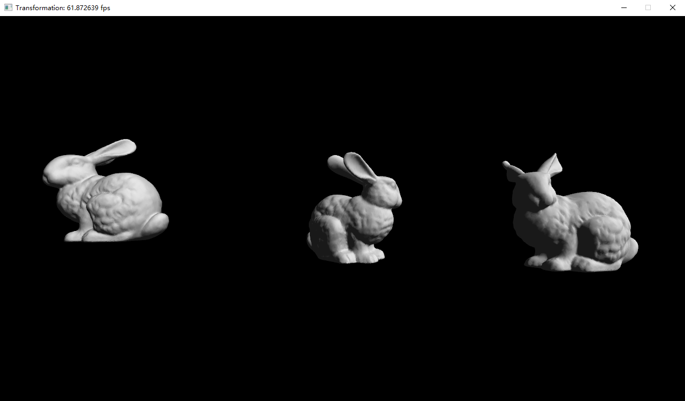

## Project 2: OpenGL三维变换
---

- 专业：
- 姓名：
- 学号：
- 日期：

#### 一、实验目的和要求
在理解OpenGL绘制物体的基础上，利用齐次坐标与矩阵变换，绘制出如下周期性变化的三只兔子，其中，其中最左边的兔子循环平移，中间的兔子不断旋转，最右边的兔子循环缩放。
<div style="text-align:center;">
  
</div>

#### 二、实验内容和原理

这是如何在Markdown中插入行内公式的示例$E = mc^2$，而下面则是插入一般公式的实例
$$
\left[\begin{matrix} a & b \\ c & d \end{matrix}\right]^{-1} =
\frac{1}{ad - bc} \left[\begin{matrix}d & - b \\- c & a\end{matrix}\right]
$$

#### 三、运行环境

#### 四、操作方法和实验步骤
```C++
// 这是一段如何在Markdown中插入C++的实例
int main() {
   return 0;
}
```

#### 五、实验结果与分析

#### 六、思考题
+ glm中的矩阵内存布局是怎样的，例如一个类型为glm::mat4的矩阵$\mathbf{m}$
  + $\mathbf{m}[i]$是什么意思？
  + $\mathbf{m}[i][j]$是什么意思？
+ 请给出下面矩阵的数学表达形式
  + 平移矩阵
  + 旋转矩阵
  + 缩放矩阵
+ 在一般的图形学教材中，我们认为点要写成4维齐次坐标的形式，模型矩阵要写成4x4的矩阵，请问对于将物体从局部坐标系变为世界坐标的这项任务中，是否一定要用4维齐次坐标，要用4x4矩阵？

#### 七、参考链接
+ [齐次坐标与坐标变换](https://learnopengl-cn.github.io/01%20Getting%20started/07%20Transformations/)
+ [OpenGL坐标系统](https://learnopengl-cn.github.io/01%20Getting%20started/08%20Coordinate%20Systems/)