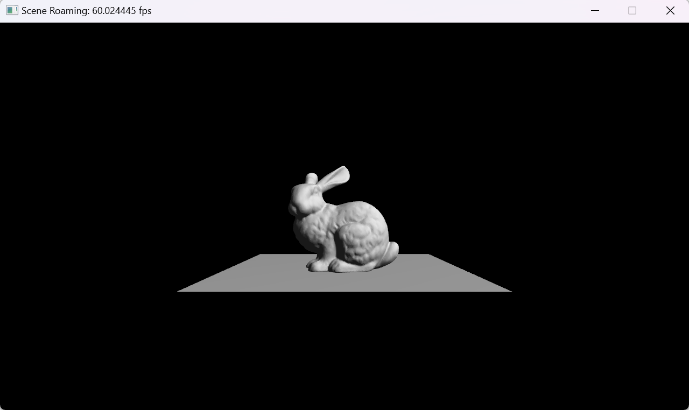

## Project 3: OpenGL摄像机
---

- 专业：
- 姓名：
- 学号：
- 日期：

#### 一、实验目的和要求
学会配置OpenGL开发环境并使用图形API绘制五星红旗。
<div style="text-align:center;">
  
</div>

#### 二、实验内容和原理

这是如何在Markdown中插入行内公式的示例$E = mc^2$，而下面则是插入一般公式的实例
$$
\left[\begin{matrix} a & b \\ c & d \end{matrix}\right]^{-1} =
\frac{1}{ad - bc} \left[\begin{matrix}d & - b \\- c & a\end{matrix}\right]
$$

#### 三、运行环境

#### 四、操作方法和实验步骤
```C++
// 这是一段如何在Markdown中插入C++的实例
int main() {
   return 0;
}
```

#### 五、实验结果与分析

#### 六、思考题
+ 我们是如何通过坐标变换抽象出一个摄像机的概念的？
+ 请给出View Matrix的数学形式
+ 请给出Projection Matrix的数学形式
  + 正交投影
  + 透视投影
+ 在Learn OpenGL的教程中，介绍了一个Y轴向上，摄像机朝向-Z方向的右手系坐标系统，请问如何将坐标系统改为与数学教科书上常用约定：Z轴向上，摄像机朝向+X方向？View Matrix与Projection Matrix要怎么改变？

#### 七、参考链接
+ [摄像机](https://learnopengl-cn.github.io/01%20Getting%20started/09%20Camera/)
+ [四元数](https://zhuanlan.zhihu.com/p/97186723)
+ [旋转矩阵与四元数](https://github.com/syby119/CG-projects/blob/main/doc/3d%20rotation.pdf)