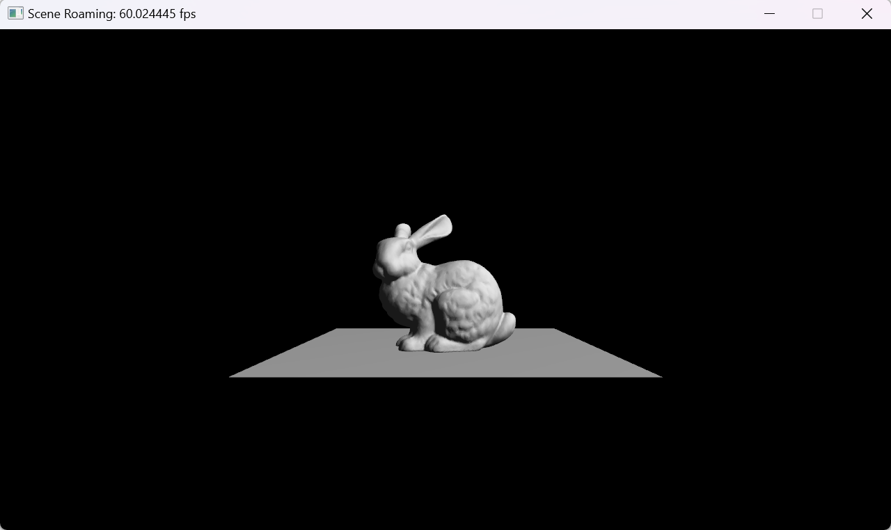

## Project 3: OpenGL摄像机
---

- 专业：
- 姓名：
- 学号：
- 日期：

#### 一、实验目的和要求
掌握四元数表示旋转的原理，编程完成正交投影和透视投影的四元数相机，并能使用键盘移动观察相机，鼠标改变观察视角，以实现FPS风格的相机控制。

  

#### 二、实验内容和原理

#### 三、主要仪器设备

#### 四、操作方法和实验步骤

#### 五、实验结果与分析

#### 六、思考题
+ 我们是如何通过坐标变换抽象出一个摄像机的概念的？
+ 请给出View Matrix的数学形式
+ 请给出Projection Matrix的数学形式
  + 正交投影
  + 透视投影
+ 在Learn OpenGL的教程中，介绍了一个Y轴向上，摄像机朝向-Z方向的右手系坐标系统，请问如何将坐标系统改为与数学教科书上常用约定：Z轴向上，摄像机朝向+X方向？View Matrix与Projection Matrix要怎么改变？

#### 七、参考链接
+ [摄像机](https://learnopengl-cn.github.io/01%20Getting%20started/09%20Camera/)
+ [四元数](https://zhuanlan.zhihu.com/p/97186723)
