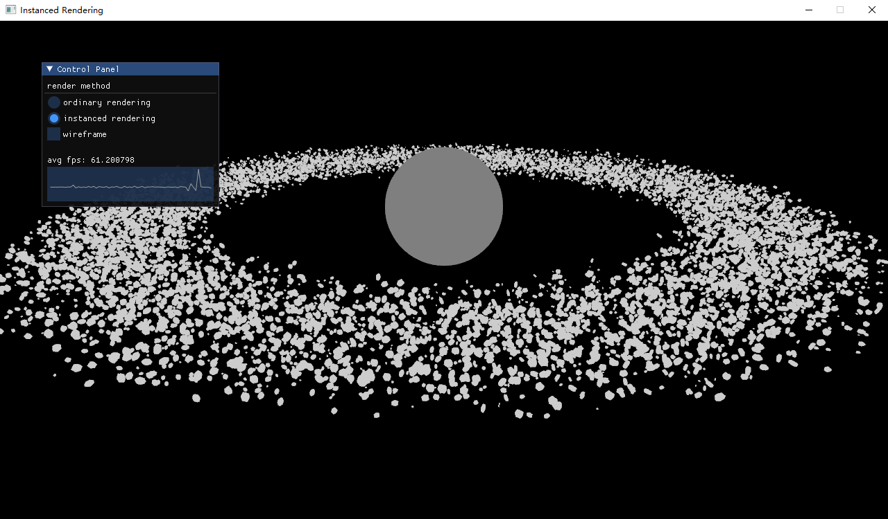

## Project 4: OpenGL实例化渲染
---

- 专业：
- 姓名：
- 学号：
- 日期：

#### 一、实验目的和要求
掌握OpenGL中实例化渲染的方法。在此基础上，利用实例化渲染技术提升下列场景绘制的帧率。

  

#### 二、实验内容和原理

#### 三、主要仪器设备

#### 四、操作方法和实验步骤

#### 五、实验结果与分析

#### 六、思考题
+ 我们是如何让GPU端解读不同实例矩阵的，在CPU端和GPU端，我们分别设置了什么？
+ 为什么OpenGL的实例化渲染提升了帧率？
+ OpenGL在glsl中，提供了一个gl_InstanceID的内建变量
  + 请查阅资料，了解这个变量的意思
  + 如果我们能够直接给顶点着色器存有不同实例矩阵的buffer的指针（OpenGL4.3 SSBO）,我们是否可以通过这个变量实现相同效果？

#### 七、参考链接
+ [OpenGL实例化渲染](https://learnopengl-cn.github.io/04%20Advanced%20OpenGL/10%20Instancing/)
