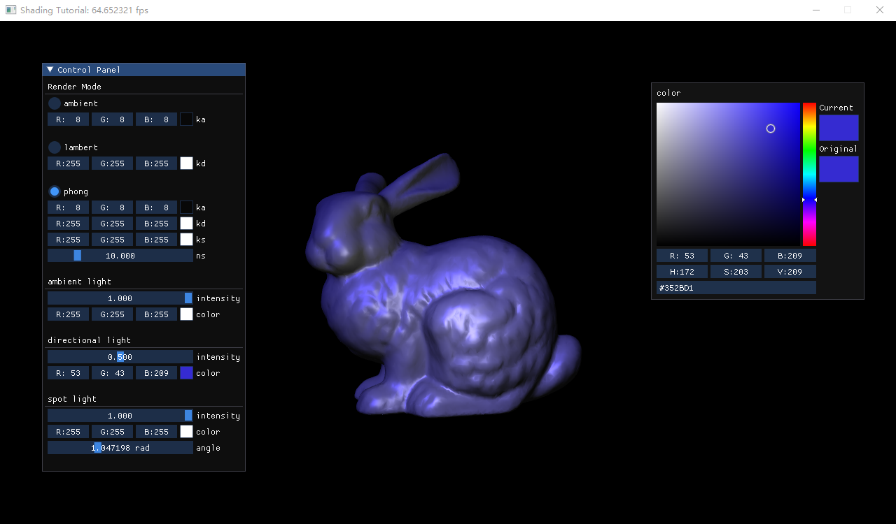

## Project 5: OpenGL光照模型
---

- 专业：
- 姓名：
- 学号：
- 日期：

#### 一、实验目的和要求
学会配置OpenGL开发环境并使用图形API绘制五星红旗。
<div style="text-align:center;">
  
</div>

#### 二、实验内容和原理

这是如何在Markdown中插入行内公式的示例$E = mc^2$，而下面则是插入一般公式的实例
$$
\left[\begin{matrix} a & b \\ c & d \end{matrix}\right]^{-1} =
\frac{1}{ad - bc} \left[\begin{matrix}d & - b \\- c & a\end{matrix}\right]
$$

#### 三、运行环境

#### 四、操作方法和实验步骤
```C++
// 这是一段如何在Markdown中插入C++的实例
int main() {
   return 0;
}
```

#### 五、实验结果与分析

#### 六、思考题
+ 什么是法线矩阵（Normal Matrix）
+ 什么是材质的BRDF？
+ Lambert材质的BRDF如何表述？
+ Phong材质的BRDF如何描述？Phong材质是物理正确的吗？
+ 不同光源有什么不同？
  + 平行光
  + 点光源
  + 聚光灯

#### 七、参考链接
+ [颜色](https://learnopengl-cn.github.io/02%20Lighting/01%20Colors/)
+ [基础光照](https://learnopengl-cn.github.io/02%20Lighting/02%20Basic%20Lighting/)
+ [材质](https://learnopengl-cn.github.io/02%20Lighting/03%20Materials/)
+ [投光物](https://learnopengl-cn.github.io/02%20Lighting/05%20Light%20casters/)
+ [多光源](https://learnopengl-cn.github.io/02%20Lighting/06%20Multiple%20lights/)