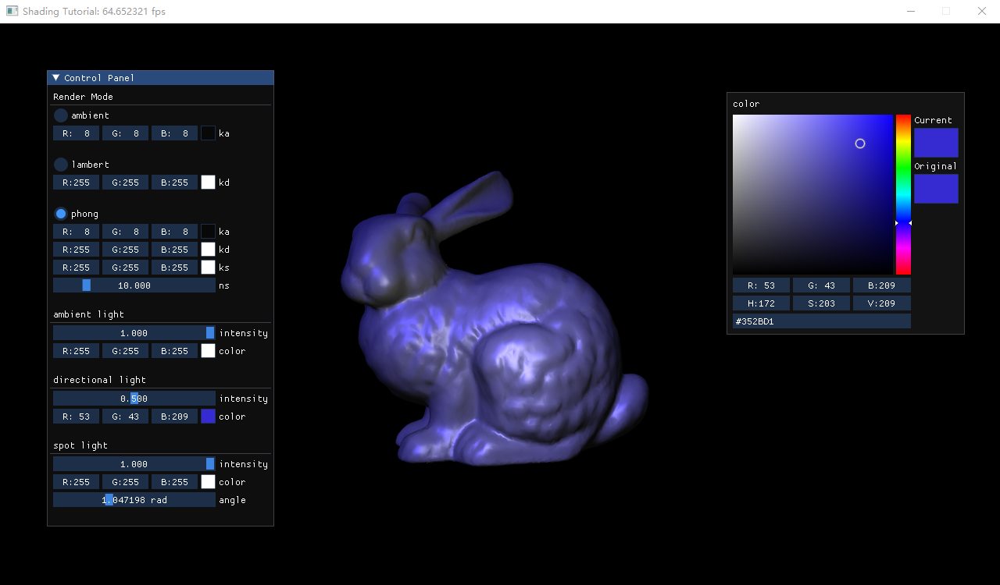

## Project 5: OpenGL光照模型
---

- 专业：
- 姓名：
- 学号：
- 日期：

#### 一、实验目的和要求
掌握着色器语言GLSL的基本语法，类比Lambert光照模型，利用GLSL书写Phong光照模型顶点着色器与片段着色器代码，并实现材质对平行光与聚光灯等光源的响应。

  

#### 二、实验内容和原理

#### 三、主要仪器设备

#### 四、操作方法和实验步骤

#### 五、实验结果与分析

#### 六、思考题
+ 什么是法线矩阵（Normal Matrix）
+ 什么是材质的BRDF？
+ Lambert材质的BRDF如何表述？
+ Phong材质的BRDF如何描述？Phong材质是物理正确的吗？

#### 七、参考链接
+ [颜色](https://learnopengl-cn.github.io/02%20Lighting/01%20Colors/)
+ [基础光照](https://learnopengl-cn.github.io/02%20Lighting/02%20Basic%20Lighting/)
+ [材质](https://learnopengl-cn.github.io/02%20Lighting/03%20Materials/)
+ [投光物](https://learnopengl-cn.github.io/02%20Lighting/05%20Light%20casters/)
+ [多光源](https://learnopengl-cn.github.io/02%20Lighting/06%20Multiple%20lights/)
