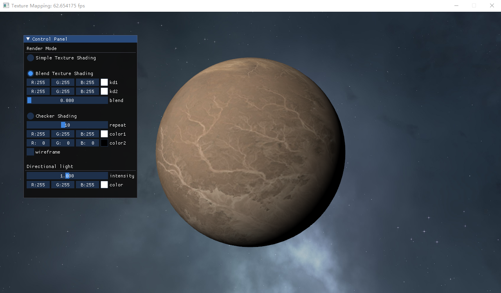

## Project 6: OpenGL纹理映射
---

- 专业：
- 姓名：
- 学号：
- 日期：

#### 一、实验目的和要求
掌握纹理映射的基本原理，并实现纹理混合、程序纹理与天空盒的绘制。

  

#### 二、实验内容和原理

#### 三、主要仪器设备

#### 四、操作方法和实验步骤

#### 五、实验结果与分析

#### 六、思考题
+ 为什么要引入纹理？纹理一定是贴图吗？
+ OpenGL中可以设置哪些纹理采样参数，它们分别是什么意思？
+ 天空盒是如何绘制的？顶点着色器中取齐次坐标中的xyww分量作为最终输出是什么意思？
+ OpenGL是如何规定对于立方体贴图的采样的？

#### 七、参考链接
+ [纹理](https://learnopengl-cn.github.io/01%20Getting%20started/06%20Textures/)
+ [立方体贴图](https://learnopengl-cn.github.io/04%20Advanced%20OpenGL/06%20Cubemaps/)
